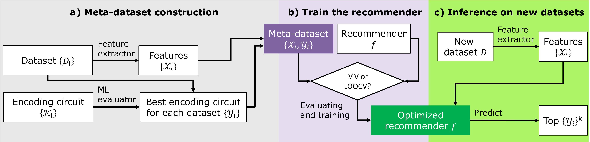

# Meta-learning for Quantum Circuits Selection

A meta-learning framework that automatically recommends the most suitable quantum encoding circuit (ansatz) for binary classification datasets, eliminating the need for exhaustive quantum kernel evaluation at inference time.

> **Paper:** *(to be updated upon publication)*

---

## Overview

Quantum kernel methods (QKMs) represent a promising class of quantum machine learning algorithms. However, selecting an appropriate encoding circuit for a given dataset typically requires evaluating all candidate circuits — a process that is computationally prohibitive on quantum hardware.

This framework addresses the problem as a **supervised meta-learning task**:

1. For each dataset in a benchmark collection, 24 classical complexity metrics are extracted and the best-performing encoding circuit is identified through empirical evaluation.
2. A classical meta-learner is trained on this meta-dataset to map complexity metrics to circuit recommendations.
3. At inference time, the trained model predicts the optimal encoding circuit for a new dataset using only classical feature extraction — no quantum evaluation is required.

The system supports two recommendation protocols (**Leave-One-Out Cross-Validation** and **Majority Voting**) with four configurations.

---

## Framework



```
Panel (a) — Meta-Dataset Construction
  200 binary classification datasets
  → 24 complexity metrics (22 Problexity + 2 Qsun)
  → 9 encoding circuits × 3 classifiers (SVC, GPC, KRC) × 10 random splits
  → Best circuit label per dataset (Task-A: single best; Task-B: tolerance-based)

Panel (b) — Meta-Learner Training & Model Selection
  Meta-dataset (features + labels)
  → 14 classical classifiers trained via LOOCV or Majority Voting
  → Trained recommendation model

Panel (c) — Inference
  New dataset → complexity feature extraction → query model → top-k circuit recommendation
```

---

## Project Structure

```
Meta-learning for Encoding Circuit Selection/
│
├── Qsun/                            # Quantum computing library (Nguyen et al., 2022)
│   ├── Qcircuit.py                  # Qubit circuit initialization
│   ├── Qwave.py                     # Wavefunction representation
│   ├── Qgates.py                    # Quantum gates (H, RX, RY, RZ, CNOT, CRZ, Phase, SISWAP, …)
│   ├── Qencodes.py                  # 9 encoding circuits
│   ├── Qkernels.py                  # Kernel computation: state_product, swap_test, hadamard_test
│   ├── Qmeas.py                     # Measurement and expectation values
│   ├── Qdata.py                     # Complexity metrics: intrinsic_dim, C(D)
│
├── datasets/
│   ├── load_data.py                 # Dataset loading and preprocessing utilitie
│   └── *.csv                        # Real-world benchmark datasets
│
├── src/
│   ├── config.py                    # ENCODING_REGISTER — maps circuit names to functions
│   └── kernel_evaluation.py         # SVC, GPC, KRC with precomputed quantum kernels
│
├── results/
│   ├── *.csv                        # Experiment outputs
│   └── plots/                       # Result figures
│   └── plotting.ipynb               # Result visualizations
│
├── [1] Quantum_Learning.ipynb       # Step 1: kernel evaluation + metric extraction
├── [2] Majority_Voting.ipynb        # Step 2a: ensemble recommendation
├── [2] LOOCV.ipynb                  # Step 2b: leave-one-out recommendation

```

---

## Getting Started

### Requirements

```bash
pip install numpy scipy scikit-learn problexity matplotlib pandas jupyter
```

> **Note:** The Qsun library is included in the `Qsun/` directory and requires no separate installation.

### Execution Order

**Step 1 — Quantum Learning** (run first)

Open and run `[1] Quantum_Learning.ipynb`. This notebook:
- Loads 200 binary classification datasets (174 synthetic, 26 real-world)
- Computes quantum kernel matrices for all 9 encoding circuits × 3 classifiers × 10 random splits
- Extracts 24 dataset complexity metrics
- Saves the meta-dataset to `results/`

**Step 2 — Meta-Learner Training** (run either or both, in any order)

- `[2] Majority_Voting.ipynb` — Trains an ensemble of 14 classical classifiers; recommendation is determined by majority vote across classifiers and random splits.
- `[2] LOOCV.ipynb` — Trains 14 classical classifiers under Leave-One-Out Cross-Validation; each fold treats one dataset as the test case.

Both notebooks evaluate performance under **Task-A** (single best circuit) and **Task-B** (tolerance-based tied-best), and perform inference on held-out real-world datasets.

---

## Citation

If you use this framework in a scientific publication, please cite the accompanying paper:

```bibtex
@article{
  (to be updated upon publication)
}
```

This project is built on top of the Qsun quantum computing library:

```bibtex
@article{Nguyen_2022,
  doi       = {10.1088/2632-2153/ac5997},
  url       = {https://doi.org/10.1088/2632-2153/ac5997},
  year      = {2022},
  month     = {mar},
  publisher = {IOP Publishing},
  volume    = {3},
  number    = {1},
  pages     = {015034},
  author    = {Nguyen, Quoc Chuong and Ho, Le Bin and Nguyen Tran, Lan and Nguyen, Hung Q},
  title     = {Qsun: an open-source platform towards practical quantum machine learning applications},
  journal   = {Machine Learning: Science and Technology}
}
```

---

## License

This project is released under the [MIT License](LICENSE).
