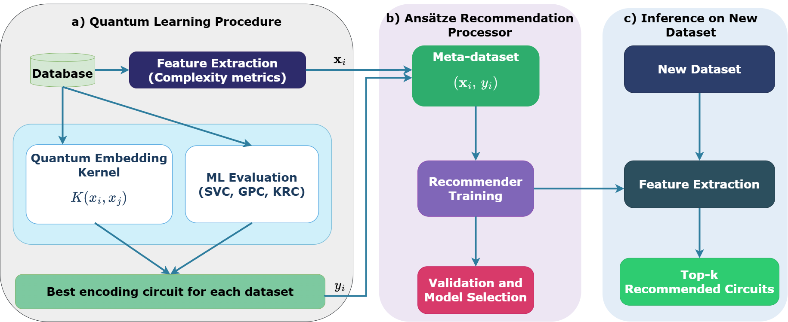

# Meta-learning for Ansatz Selection

A meta-learning framework that recommends the optimal quantum encoding ansatz for binary classification datasets using classical complexity metrics.

## Workflow


## Project Structure

```
Meta-learning for Ansatz Selection/
│
├── Qsun/
│   ├── Qcircuit.py
│   ├── Qdata.py
│   ├── Qencodes.py
│   ├── Qgates.py
│   ├── Qkernels.py
│   ├── Qmeas.py
│   └── Qwave.py
│
├── datasets/
│   ├── load_data.py
│   └── *.csv
│
├── results/
│   ├── *.csv
│   └── plots/
│
├── src/
│   ├── config.py
│   └── kernel_evaluation.py
│
├── [1] Quantum Learning.ipynb
├── [2] Majority Voting.ipynb
└── [2] LOOCV.ipynb
```

## Execution Order

1. `Quantum Learning.ipynb` — Run this first. Loads all datasets, computes quantum kernel matrices (9 ansätze × 3 ML models × 10 runs), extracts 24 complexity metrics, and generates the Synthetic Training Dataset. Outputs are saved to `results/`.

2. `Majority Voting.ipynb` and `LOOCV.ipynb` — Run after Step 1, in any order (they are independent). Both read the CSV files from `results/`, train recommendation models, evaluate accuracy across Task-A and Task-B (single metric vs all metrics), and perform inference on 7 new test datasets.

## Citation policy

If you use this framework in a scientific publication, we would appreciate a citation to the following paper:

```
@article{
  (to be updated upon publication)
}
```

This project is built on top of the [Qsun](https://github.com/ChuongQuoc1413017/Quantum_Virtual_Machine.git) quantum computing library:

```
@article{Nguyen_2022,
  doi = {10.1088/2632-2153/ac5997},
  url = {https://doi.org/10.1088/2632-2153/ac5997},
  year = {2022},
  month = {mar},
  publisher = {IOP Publishing},
  volume = {3},
  number = {1},
  pages = {015034},
  author = {Nguyen, Quoc Chuong and Ho, Le Bin and Nguyen Tran, Lan and Nguyen, Hung Q},
  title = {Qsun: an open-source platform towards practical quantum machine learning applications},
  journal = {Machine Learning: Science and Technology}
}
```
